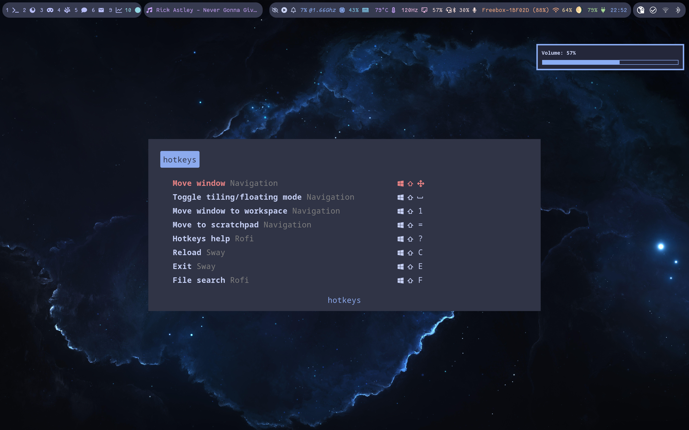
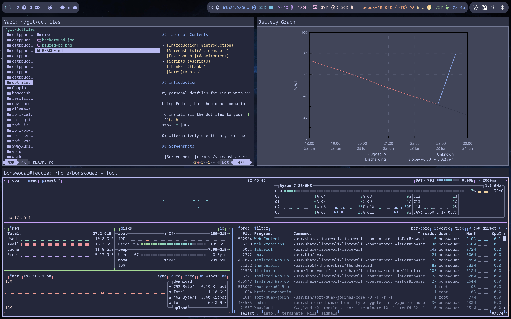

## Table of Contents

- [Introduction](#introduction)
- [Screenshots](#screenshots)
- [Environment](#environment)
- [Scripts](#scripts)
- [Thanks](#thanks)
- [Notes](#notes)

## Introduction

My personal Linux dotfiles with Sway.

Using Fedora, but should be compatible with many distributions.

To install all the dotfiles to `$HOME` with one command:
```bash
stow -t $HOME .
```
Or alternatively (recommended), only for the directories needed (`man stow` or `tldr stow`)

## Screenshots





## Environment & Apps

  - `bat` cat alternative
  - `besgnulinux-mono-grey` icons
  - `btop` resource monitor
  - `cliphist` clipboard history
  - `dunst` notifications
  - `fastfetch` fetcher
  - `FantasqueSansM Nerd Font` and `fontawesome5` fonts
  - `foot` terminal emulator
  - `fzf` fuzzy finder
  - `gnuplot` plot viewer
  - `gnu stow` symlinks manager
  - `grimshot` screenshots
  - `joplin` encrypted notes client
  - `keepassXC` password manager
  - `kvantum` Qt apps styling
  - `lazygit` git TUI interface
  - `librewolf` web browser
  - `mosh` mobile ssh
  - `mpv` video player
  - `nano` text editor
  - `rofi-wayland` launcher
  - `sddm` login screen
  - `starship` prompt
  - `sway` window manager
  - `swayimg` image viewer
  - `swaylock` lock screen
  - `tldr` man but simpler
  - `VsCodium` IDE
  - `waybar` status bar
  - `wl-clipboard` clipboard manager
  - `yazi` TUI file manager
  - `zoxide` cd but smarter

## Special Hotkeys

All you need is:
- `Mod + Shift + ?` will show a rofi menu that lists all key bindings

Note: Bindings originally made for an **AZERTY** keyboard
Note²: Only Sway binding will work by selecting & pressing Enter on rofi

## Scripts

Useful scripts are located in `.local/bin/`

## Thanks

- [catppuccin](https://github.com/catppuccin/) for the color palette and themes
  - [Catppuccin-GTK-Theme](https://github.com/Fausto-Korpsvart/Catppuccin-GTK-Theme) for gnome apps/menus integration
- [Speyll/dotfiles](https://github.com/Speyll/dotfiles/blob/main/README.md) for the README inspiration
- [battery-stats](https://github.com/bonswouar/battery-stats/) forked from [petterreinholdtsen/battery-stats](https://github.com/petterreinholdtsen/battery-stats) for battery monitoring and graph
- Many other public repositories for some scripts and inspiration, including:
  - [autotiling](https://github.com/nwg-piotr/autotiling): autotiling for sway/i3
  - [battnotify](https://github.com/kovmir/battnotify): notify when battery low
  - [Gnuplot-Pywal](https://github.com/GideonWolfe/Gnuplot-Pywal): generate gnuplot config
  - [lessfilter-pygmentize](https://github.com/CoeJoder/lessfilter-pygmentize): colors for less
  - [rofi-calc](https://github.com/svenstaro/rofi-calc): rofi calculator
  - [rofi-grimshot](https://github.com/FantomeBeignet/rofi-grimshot): rofi screenshots with grimshot
  - [rofi-i3-shortcut-help](https://gitlab.com/matclab/rofi-i3-shortcut-help): list rofi key bindings
  - [rofi-power-menu](https://github.com/jluttine/rofi-power-menu): a power menu for rofi
  - [rofi-systemd](https://github.com/colonelpanic8/rofi-systemd): a systemd/journalctl management menu for rofi
  - [SwayAudioIdleInhibit](https://github.com/ErikReider/SwayAudioIdleInhibit): inhibit sleep when audio is playing
  - [wlsunset](https://git.sr.ht/~kennylevinsen/wlsunset): auto redshift for wayland

## Notes

- This is made for my personnal hardware, on a laptop with a resolution of 2880x1800
- Some scripts can be missing, usually when they come directly from an external repository
- `LATITUDE` and `LONGITUDE` env vars are needed for `wlsunset` (for example in `.bash_profile`), `update-lat-lng.sh` can be used to automatically update them
- `WASTEBIN_URL` env var needed if you want to use `wastebin` script
- `ROFI_SYSTEMD_TERM` env var needed for `rofi-systemd`
- Gtk theme set with `gsettings set org.gnome.desktop.interface gtk-theme Catppuccin-Dark-Compact-Frappe`
- Qt theme set with `kvantummanager`
- Regenerate a gnuplot config (used for `battery-graph`) based on color palettes located in `~/.config/gnuplot` with the command `gengnuplotconfig > $HOME/.gnuplot`
